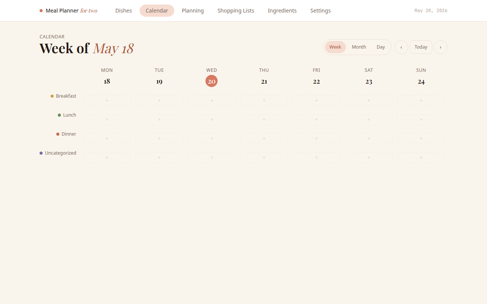
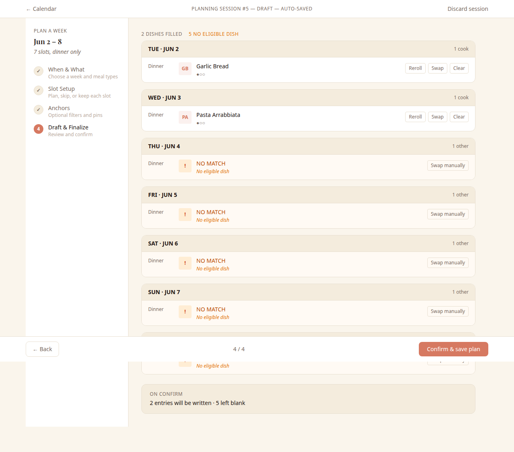
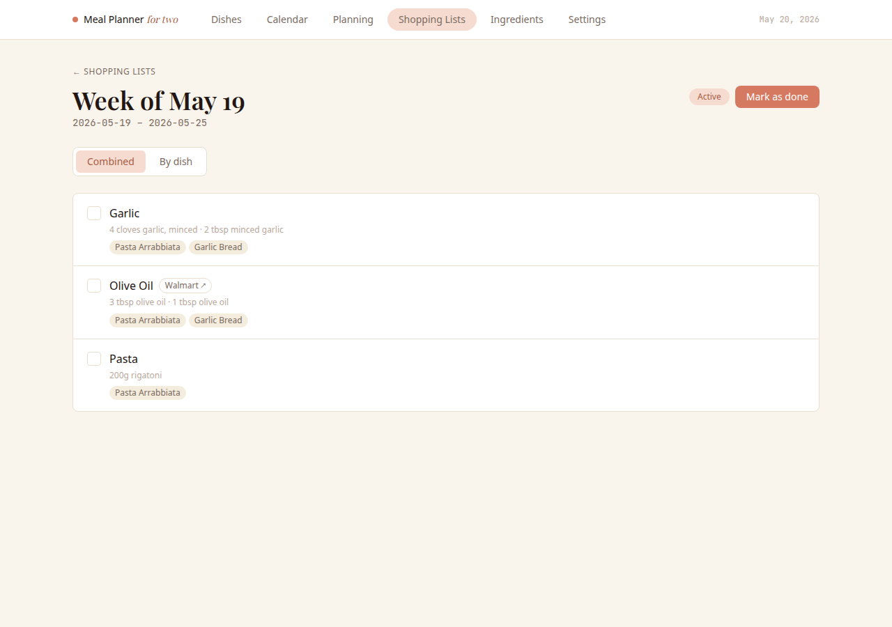
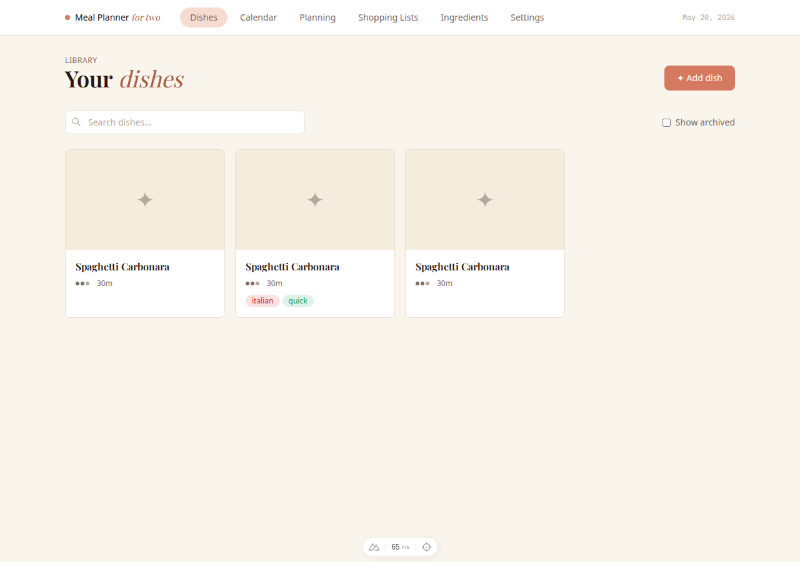

# Meal Planner

A self-hosted meal planning web app built for household use. Plan your week, manage a dish library, generate shopping lists, and let a weighted suggestion engine nudge you toward variety and freshness.

> **Personal use only.** This app has no authentication or authorization. It is designed for a private home network (LAN or Tailscale VPN). **Do not expose it to the public internet.**

---

## Screenshots

<table>
<tr>
<td></td>
<td></td>
</tr>
<tr>
<td align="center"><em>Calendar — week view with drag-and-drop</em></td>
<td align="center"><em>Planning wizard — draft &amp; finalize step</em></td>
</tr>
<tr>
<td></td>
<td></td>
</tr>
<tr>
<td align="center"><em>Shopping list — combined view with Walmart links</em></td>
<td align="center"><em>Dish library with search and filters</em></td>
</tr>
</table>

---

## Features

- **Dish library** — store recipes with ingredients, tags, difficulty, cook time, season, and a source URL. Import from recipe sites automatically.
- **Calendar** — week, month, and day views. Drag and drop entries between slots. Mark leftovers.
- **Planning wizard** — 4-step guided session: pick the week, configure each slot, set anchor constraints (pinned tags, wishlist tags, dietary virtual tags), then review a weighted-random draft with per-slot reroll and swap controls.
- **Suggestion engine** — dishes are ranked by how overdue they are relative to their target interval. Cooldown prevents a dish from appearing too soon after it was last served fresh.
- **Shopping lists** — generate from a date range; grouped by ingredient with Walmart links; check items off as you shop; auto-cleanup after done.
- **Backups** — automated hourly SQLite backups with configurable retention, plus a manual pre-deploy backup script.
- **Responsive** — usable on phones and tablets.

---

## Quick start

Requires Docker with Compose.

```bash
# 1. Copy the deploy template
cp deploy/compose.yml ./compose.yml

# 2. Create a .env with your Watchtower token
echo 'WATCHTOWER_TOKEN=choose-a-long-random-secret' > .env

# 3. Start
docker compose up -d
```

Open `http://localhost:3000` (or replace `localhost` with your host's LAN/Tailscale address).

See [`deploy/README.md`](deploy/README.md) for full deployment details including updates, backups, and volume management.

---

## Configuration

All configuration is via environment variables. The defaults work out of the box for the Docker deployment.

| Variable | Default | Description |
|---|---|---|
| `DATABASE_URL` | `/data/app.db` | SQLite file path |
| `IMAGE_DIR` | `/data/images` | Uploaded dish image directory |
| `BACKUP_DIR` | `/data/backups` | Automated backup output directory |

Backup interval and retention count are configured in the app's Settings page (stored in the database, no restart needed).

---

## Documentation

Full specs live in [`docs/`](docs/):

- [`docs/spec.md`](docs/spec.md) — feature spec and business rules
- [`docs/data-model.md`](docs/data-model.md) — database schema and field semantics
- [`docs/planning-mode.md`](docs/planning-mode.md) — planning wizard algorithm in detail
- [`docs/design-system.md`](docs/design-system.md) — design tokens and component patterns
- [`docs/backlog.md`](docs/backlog.md) — milestone history

---

## Development

```bash
pnpm install
pnpm dev          # http://localhost:3000
pnpm build        # production build
pnpm typecheck
pnpm lint

# Tests run inside Docker — do not run pnpm test directly
docker compose run --rm test
```

---

## Notes

This app is intentionally opinionated and built for a single household. There's no multi-user support, no per-user preferences, and no access control — all data is globally shared. If you want to adapt it for different household sizes, dietary constraints, or workflows, forks are welcome.
